# Web App Part 3 - Supabase queries and filtering

Enda Lee 2024


## Introduction

This tutorial continues from [part 2](https://github.com/elee-tudublin/2024.Y2.3_Project_sveltekit_show_data) 

This part provides examples of how to query the computers/ events database via the Supabase API to filter and sort data in the web application


### Useful links and guides for building Supabase queries

** IMPORTANT: Read the API docs for your database in the Supabase dashboard **   

| select         | https://www.restack.io/docs/supabase-knowledge-supabase-api-select-guide#clpx3g95y0g2xvh0vwuz164y1 |
| -------------- | ------------------------------------------------------------ |
| where          | https://www.restack.io/docs/supabase-knowledge-supabase-client-raw-sql-guide |
| 1-to-m/ m-to-m | https://www.restack.io/docs/supabase-knowledge-supabase-nested-query-guide |
| 1-to-m/ m-to-m | https://github.com/orgs/supabase/discussions/7958            |
| filter queries | https://supabase.com/docs/reference/javascript/filter        |
| filter queries | https://www.restack.io/docs/supabase-knowledge-supabase-filter-guide |
| sort           | https://www.restack.io/docs/supabase-knowledge-supabase-select-sort-guide#clpzufwv80mklvh0v4bcbkn5f |
| sort           | https://stackoverflow.com/questions/77049329/how-to-order-by-multiple-columns-in-supabase |
| ilike          | https://github.com/orgs/supabase/discussions/6778            |


## 1. Pre-requisites

The client functionality is dependent on the Supabase DB from [Supabase Setup](https://github.com/elee-tudublin/2024.Y2-Project_Supabase_Setup). Make sure your Database is setup before continuing. You shou lalso have completed the [Sveltekit Intro Tutorial](https://github.com/elee-tudublin/2024.Y2.2_Project_sveltekit_intro).

The tutorial is based on the code example in this repository

1. Download the start site from this repository (either PULL or download the zip file).

2. Open in VS Code.

3. In a terminal run **`npm install`**.

4. Add your Supabase URL and anon API key to  **`.env`** (use `.env.example` as a template). 

5. Start the application using **`npm run dev`**.


## 2. Application Structure

The application has been reorganised to make the code examples more readable.

All of the Supbase query functions can be found in a single file, **`str/lib/data_access.js`**.   Keeping the  function in one place makes them easier to maintain and share with whichever pages need them in the app. Note that the foction definitions all start with the `export` keyword, so that they can be `imported` elsewhere.

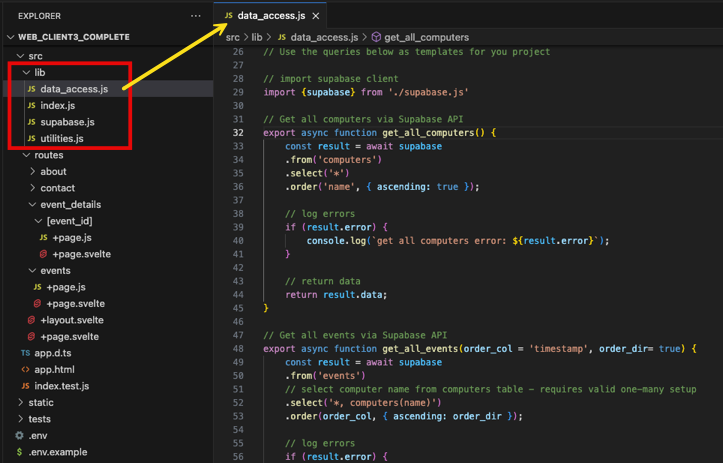


This file is then imported in pages, as required, for example in the events page load script:

The first line imports the data access functions as **`db`**. Then the exported functions are accessed using **`db.get_all_computers()`** etc.

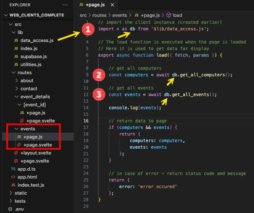


`utilities.js` can also be found in the `lib` folder. This file will be used to share useful functions.


## 3. Application Features

When the app loads, you will see some new features:

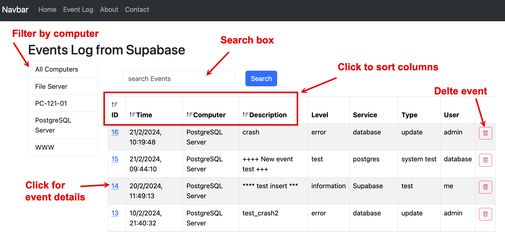


The functions which handle click events in the page can be found in `src/routes/events/+page.svelte`. 

The features rely on a `svelte` feature called `stores` which is used to make the page **reactive**. This means that any change to the `events` store will automatically update the page.  

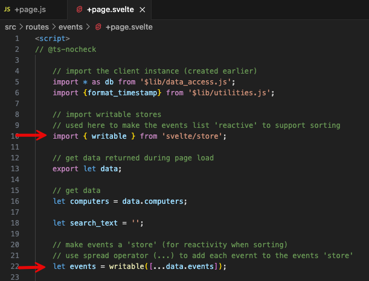


The events list is then refered to as **`$events`**, (note the **$**) making it reactive - for example:

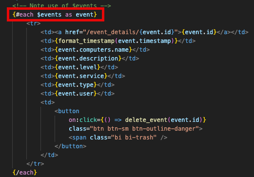

### 3.1. Sorting

Clicking a column header changes the sort order of the table, ascending or descending, based on the columns

1. When clicked,  the column headers call the `sort_by_col()` function, passing the column name (from the events table) as a parameter.

   ```html
   th class="click-text" on:click={() => sort_by_col('id')}>
   ```

   

2. A bootstrap icon is used to indicate sort direction based on the `table_sort` value for that column. Ths code checks the if the value is true or false (e.g. `table_sort['id'] ?`). If true set   `class="bi bi-sort-down"`  if false set `class="bi bi-sort-up"`

   ```html
   <i class={ table_sort['id'] ? 'bi bi-sort-down' : 'bi bi-sort-up'}
   ```

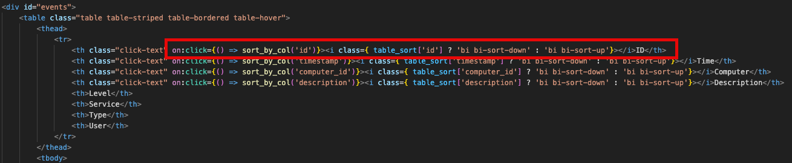


The `table_sort` object - which keeps track of sor direction for each col. Also `sort_by_col()` which handles the click events. the `get_all_events()` function, defined in `src/lib/data_access.js` is called to get the required data.

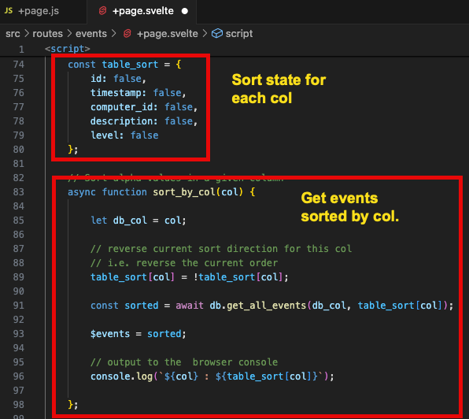


### 3.2. Searching

The search box provides another way to filter events by text submitted via the form.

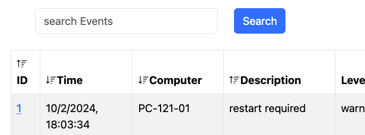

Examine the page html to see how it works:

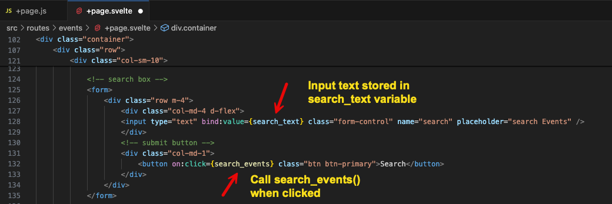


The `search_events()` function is cahhed when the buuton is clicked and updates the page with the result.

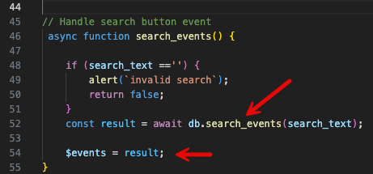


The function calls the `search_events()` function, defined in `src/lib/data_access.js` is called to get the required data.

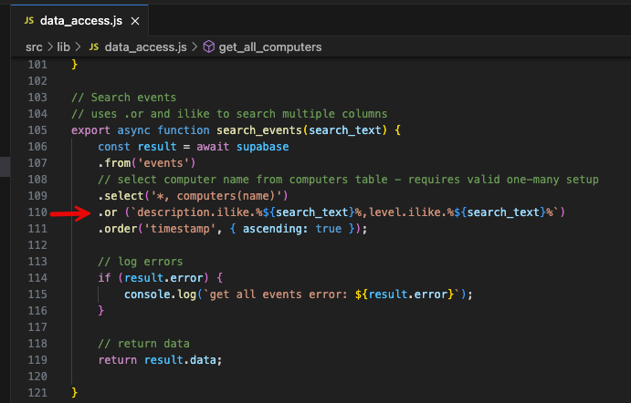

The `.or` line compares the `description` and `level` columns with the `search_text`. Read it carefully!


### 3.3. Details page

The details pages shows details for a single event and its computer. It can be accessed by clicking the id link for an event.

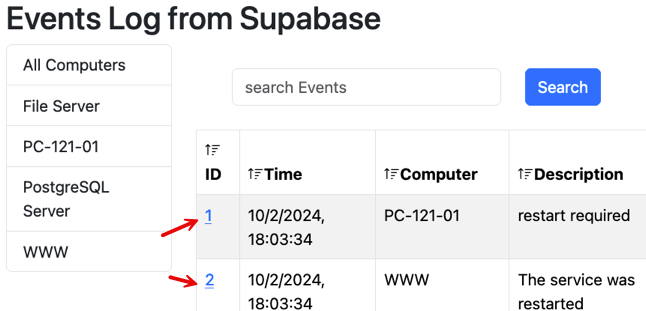


The code reveals a link to `/event_details/{event.id}`. This will generate a unique link for each event based on its id.

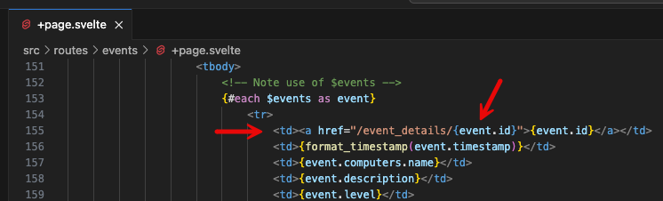 


The `event_details` route/ page is set up to accept a paramter named `event_id`. n Sveltekit, this is achieved by including a subfolder, named with the paramter in square brackets, e.g. `[event_id]`. Inside that folder, the `load()` function in `+page.js` reads the parameter. 

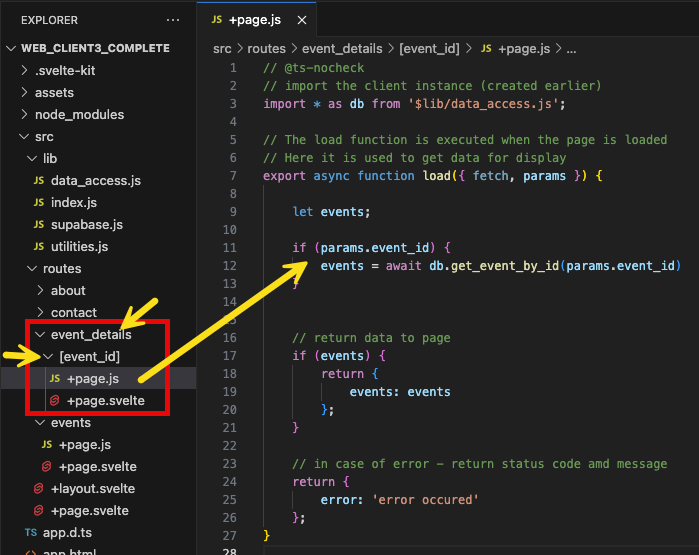

In this example, the `event_id` param is used to call the `get_event_by_id()`  function from `src/lib/data_access.js`.

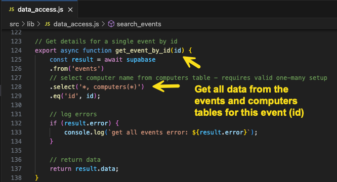


### 3.4. Delete Event

Each event in the table includes a button to delete that event.

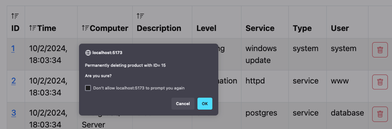 


The buttons are styled using Bootstrap and when clicked, call the `delete_event()` function. 

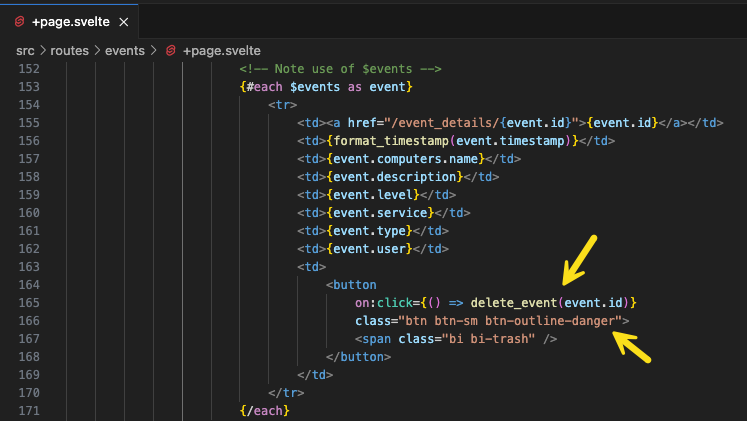


The function accpts the `id` of the event to be deleted, prompts for confirmation, then calls the `delete_event_by_id()` function from `src/lib/data_access.js`.

.png)


## 4. Next steps

It is important to work through all of the examples above and try them with the computers and events table in your database. Some of these features may also be useful in your project. Also see the Supabase API documentation and the links above for other examples of how to query the database and filter results.


------

Enda Lee 2024
